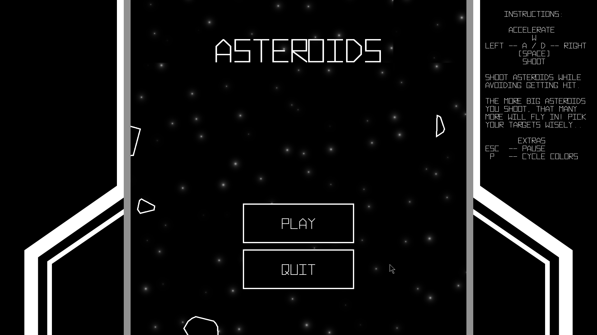
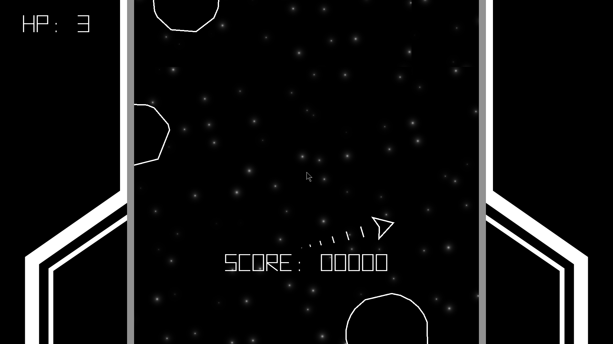

# 151 Final - Asteroids
Project for the CS-151 final during my first year at North Idaho College, written in C++ and using [SFML](https://www.sfml-dev.org/).







## Build Instructions
If you are building on Windows and using G++ via MSYS2, it is recommended to install SFML via the MSYS2 UCRT terminal with the following command:

```bash
pacman -S mingw-w64-ucrt-x86_64-sfml
```

From there, if you are on Windows, update the CMakeLists.txt file with the path to the OpenAL dll, e.g. `C:/msys64/ucrt64/bin/libopenal-1.dll` (note that this appears as OPENAL_PATH in the CMake cache for easy editing).

> [!IMPORTANT] 
> It's required to manually move any shaders (i.e. stars.frag) to `build/bin`. While this can be automated with CMake down the line, it makes editing shaders awkward; since the shaders are loaded at runtime, it's possible to modify the shaders without rebuilding the entire application, which leads to very quick iteration when editing shaders. 
>
> One simple solution is to make a symbolic link for the file. Ideally, such workarounds won't be necessary later. 
